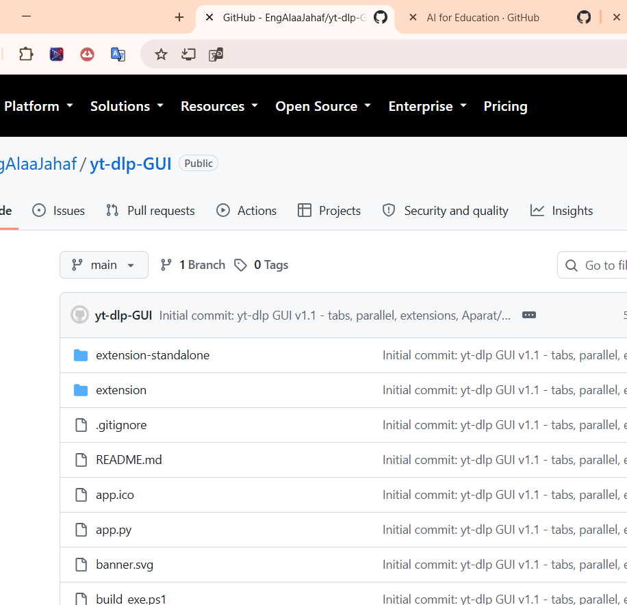
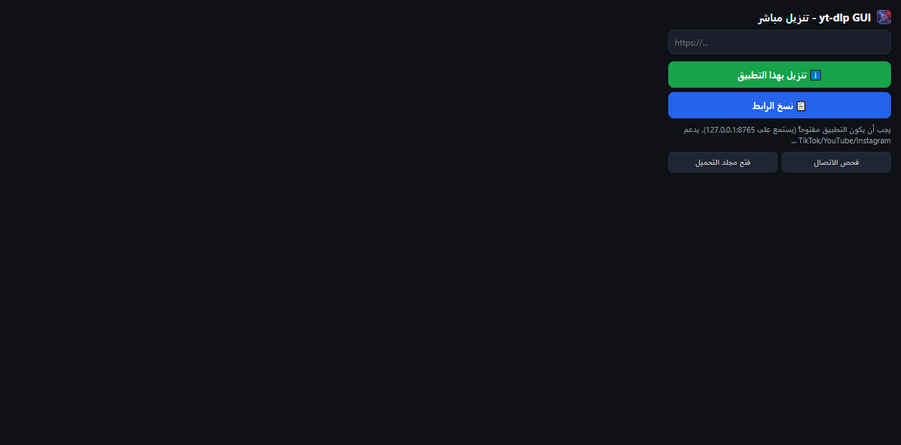
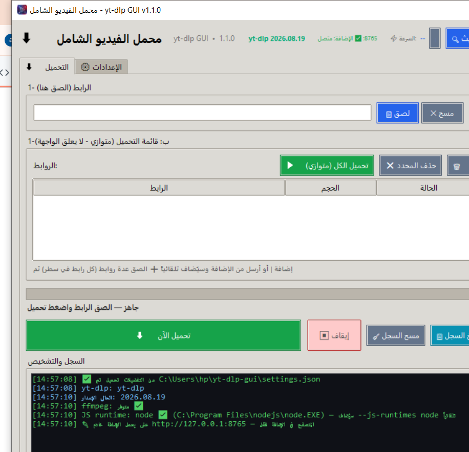

# ⬇️ محمل الفيديو الشامل - yt-dlp GUI

[](https://python.org)
[](https://github.com/yt-dlp/yt-dlp)
[](https://docs.python.org/3/library/tkinter.html)
[](LICENSE)
[](https://github.com/yt-dlp/yt-dlp/blob/master/supportedsites.md)

واجهة رسومية مستقلة لـ **yt-dlp** تدعم **1752 موقع** (YouTube/TikTok/Instagram/Facebook/X...) مع تحميل متوازي لا يعلق، وإضافات متصفح، وحلول ذكية لـ Aparat/Meyon/Udemy.

> **المستودع:** `https://github.com/EngAlaaJahaf/yt-dlp-GUI`

---

## 📑 جدول المحتويات
- [المميزات](#-المميزات)
- [المواقع المدعومة](#-المواقع-المدعومة)
- [التقنيات](#-التقنيات)
- [المتطلبات](#-المتطلبات)
- [التثبيت والتشغيل](#-التثبيت-والتشغيل)
- [بناء exe مستقل](#-بناء-exe-مستقل)
- [إضافة المتصفح](#-إضافة-المتصفح)
- [الاستخدام](#-الاستخدام)
- [لقطات الشاشة](#-لقطات-الشاشة)
- [هيكل المشروع](#-هيكل-المشروع)
- [استكشاف الأخطاء](#-استكشاف-الأخطاء)
- [الترخيص](#-الترخيص)

---

## ✨ المميزات
1. **⬇️ تحميل بضغطة** - الصق الرابط فقط، كشف تلقائي 🎵 TikTok / ▶️ YouTube
2. **⚡ متوازي 1-5** - قائمة انتظار مع شريط لكل فيديو، لا يعلق الواجهة
3. **⚙️ تبويبات** - ⬇️ التحميل و ⚙️ الإعدادات (جودة/صيغة/مجلد/كوكيز/Proxy)
4. **🔑 كوكيز تلقائي** - --cookies-from-browser chrome/edge/firefox بدون ملف يدوي
5. **💾 حفظ التفضيلات** - settings.json يُحمّل تلقائياً
6. **📝 ترجمة فقط** - --skip-download --write-sub مع اختيار اللغة ar,en والصيغة vtt/srt
7. **🔌 خادم إضافة** - 127.0.0.1:8765 يستقبل من المتصفح
8. **🧩 إضافتان** - متكاملة (ترسل لـ GUI) ومستقلة (مباشر mp4)
9. **🎬 Aparat/Meyon/Udemy** - fallback عبر API زر دانلود و PeerTube HLS
10. **🎨 ألوان معبرة** - أخضر تحميل/أحمر إيقاف/أزرق فحص

---

## 🌐 المواقع المدعومة
1752 مستخرج — كل مواقع yt-dlp: YouTube/TikTok/Vimeo/Dailymotion/Instagram/Facebook/X/SoundCloud/Twitch/Kick/...  
القائمة: `yt-dlp --list-extractors` أو [supportedsites.md](https://github.com/yt-dlp/yt-dlp/blob/master/supportedsites.md)

---

## 🛠 التقنيات
| المكون | التقنية |
|--------|---------|
| GUI | Python 3.11 + Tkinter (clam) |
| التحميل | yt-dlp 2026.08.19 + ffmpeg 8.0.1 + curl_cffi |
| الإضافات | Manifest V3 + ThreadingHTTPServer |
| البناء | PyInstaller 6.22 |

---

## 📋 المتطلبات
| المتطلب | الإصدار |
|---------|---------|
| Python | 3.11+ |
| pip | 25+ |
| Git | أي إصدار |
| ffmpeg | 8.0+ (مدمج في exe) |
| Node.js | 22+ (اختياري لـ JS runtime) |

---

## 🚀 التثبيت والتشغيل

### 1. استنساخ
```bash
git clone https://github.com/EngAlaaJahaf/yt-dlp-GUI.git
cd yt-dlp-GUI
```

### 2. بيئة افتراضية (اختياري)
```bash
python -m venv .venv
# Windows
.venv\Scripts\activate
```

### 3. التبعيات
```bash
pip install yt-dlp Pillow
```

### 4. التشغيل
```bash
python app.py
# أو
.\run.bat
```

---

## 📦 بناء exe مستقل
```powershell
powershell -ExecutionPolicy Bypass -File build_exe.ps1
```
المخرجات:
- `dist\yt-dlp-GUI\yt-dlp-GUI.exe` — مجلد مستقل (**مستحسن**، يدعم `yt-dlp -U`)
- `dist\yt-dlp-GUI-Portable.exe` — ملف واحد محمول ~215 MB

---

## 🧩 إضافة المتصفح

### Chrome / Edge
1. افتح `chrome://extensions` أو `edge://extensions`
2. فعّل `وضع مطوّر البرامج` (Developer mode)
3. `Load unpacked` → اختر:
   - **المتكاملة:** `yt-dlp-GUI\extension` (ترسل لـ GUI عبر 127.0.0.1:8765)
   - **المستقلة:** `yt-dlp-GUI\extension-standalone` (مباشر mp4 فقط)
4. افتح أي فيديو → كليك يمين `⬇️ تنزيل بهذا التطبيق` أو أيقونة الإضافة → `تنزيل`
5. **Udemy:** ستظهر خيارات `⬇️ تنزيل مباشر` و `📋 فتح قائمة الكورس كاملة` (1092x700)

> يجب أن يكون `yt-dlp-GUI.exe` مفتوحاً (يستمع على 127.0.0.1:8765)

### Firefox
`about:debugging#/runtime/this-firefox` → `Load Temporary Add-on` → اختر `manifest.json`

---

## 🎮 الاستخدام
1. الصق الرابط في الحقل العلوي (يدعم عدة روابط كل رابط في سطر) → `➕ إضافة للقائمة`
2. اختر الجودة/الصيغة في تبويب `⚙️ الإعدادات`
3. للـ Udemy/المحتوى الخاص: `الكوكيز → chrome → 🔑 التقاط` (أغلق المتصفح إذا فشل)
4. حدد فيديوهات من القائمة أو اترك الكل → `▶️ تحميل الكل (متوازي)` أو `⬇️ تحميل الآن` (ذكي)
5. تابع `السجل والتشخيص` + `⚡ السرعة` في الأعلى وحجم كل فيديو

---

## 📸 لقطات الشاشة

| التحميل | الإعدادات | الإضافة |
|---------|-----------|---------|
|  |  |  |
|  |  |  |

> الصور في `screenshots/` — شغّل `python app.py` والتقط عبر `Win+Shift+S`

---

## 📁 هيكل المشروع
```
yt-dlp-GUI/
├── app.py                 # الواجهة + الخادم + المتوازي
├── build_exe.ps1          # بناء OneDir/OneFile
├── extension/             # إضافة متكاملة (yt-dlp)
│   ├── manifest.json
│   ├── background.js      # Udemy مباشر + إرسال لـ GUI
│   ├── popup.html/js
│   └── udemy.html         # قائمة كورس كاملة
├── extension-standalone/  # إضافة مستقلة (مباشر)
├── app.ico/icon.png       # الأيقونة المفرغة
├── settings.json          # التفضيلات (يُنشأ تلقائياً)
└── dist/                  # المخرجات (مُستبعد من git)
```

---

## 🔍 استكشاف الأخطاء
| الخطأ | السبب | الحل |
|-------|-------|------|
| `Resolving timed out` | DNS | غيّر DNS لـ 1.1.1.1 / `ipconfig /flushdns` / فعّل `Force IPv4` |
| `Could not copy Chrome cookie` | Chrome مقفل | أغلق Chrome تماماً Task Manager → أعد `🔑 التقاط` |
| `403 Forbidden Udemy` | Bearer ناقص | استخدم `--cookies-from-browser` بدل ملف |
| `og:title Aparat` | مستخرج معطل | يُحمّل تلقائياً عبر `api file_link_all` |
| `Unsupported URL meyon` | SPA | استخدم رابط `embed` أو الإضافة المستقلة |

---

## 📄 الترخيص
MIT — للاستخدام الشخصي، لا تعيد نشر محتوى محمي.
